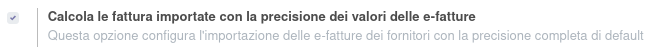
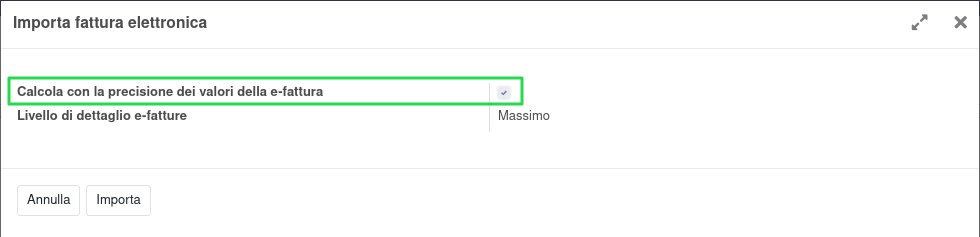

Nella configurazione della contabilità è possibile impostare di default l'opzione per l'utilizzo della funzionalità fornita da questo modulo:

In ogni caso durante la procedura di importazione della e-fattura è posssibile decidere se utilizzare o meno la funzionalità:

