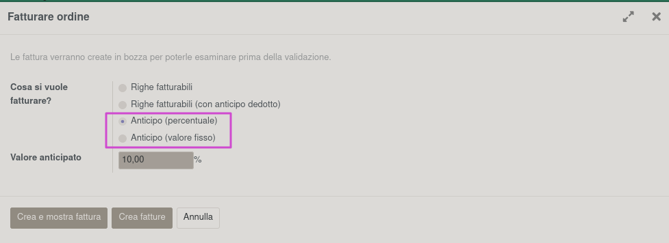

**Italiano**

Impostare nei registri (solo in quelli di vendita) il tipo di documento fiscale per le fatture di accconto:

Alla creazione di nuove fatture di acconto tramite la procedura negli ordini di vendita:

verrà automaticamente impostato il tipo di documento fiscale:

**English**

Set in journal (only sale type) the document fiscal type per advance invoices:

At invoice create with sale advance wizard:

the fiscal document type will be automatically set:

