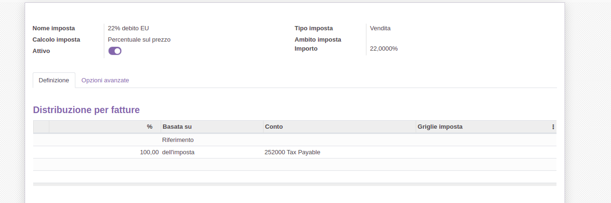
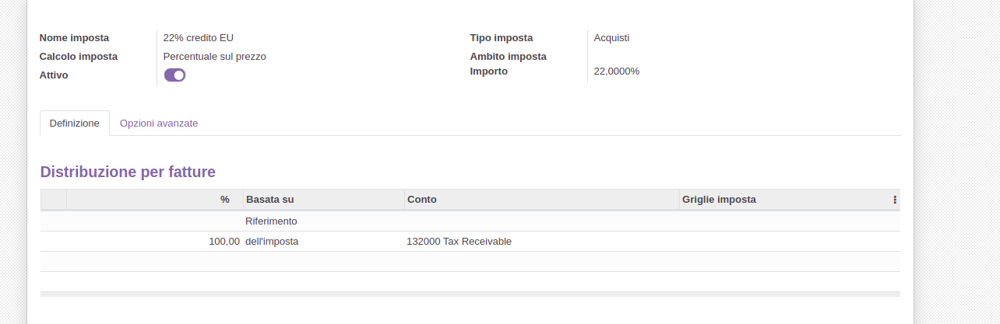
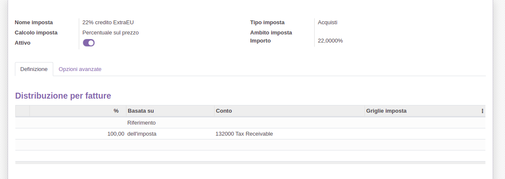
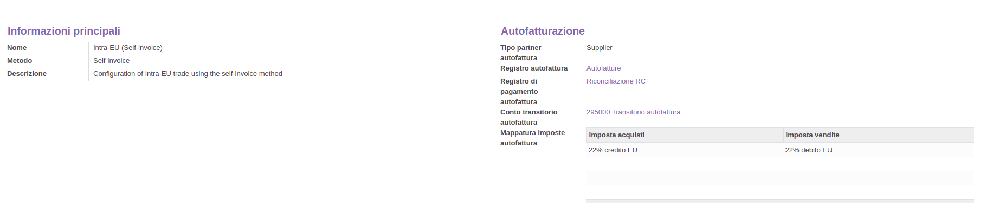
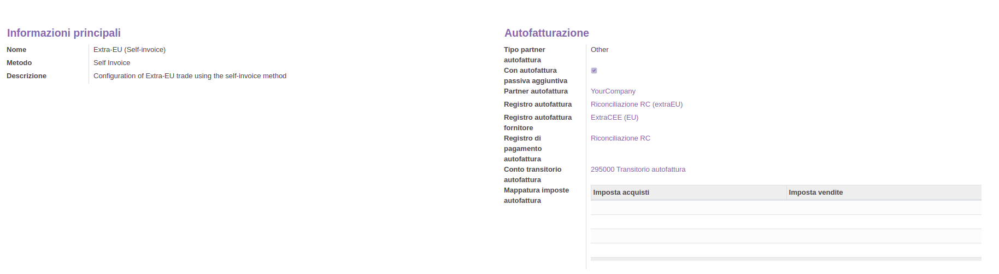
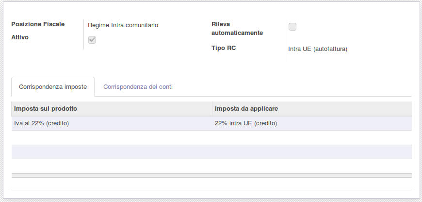
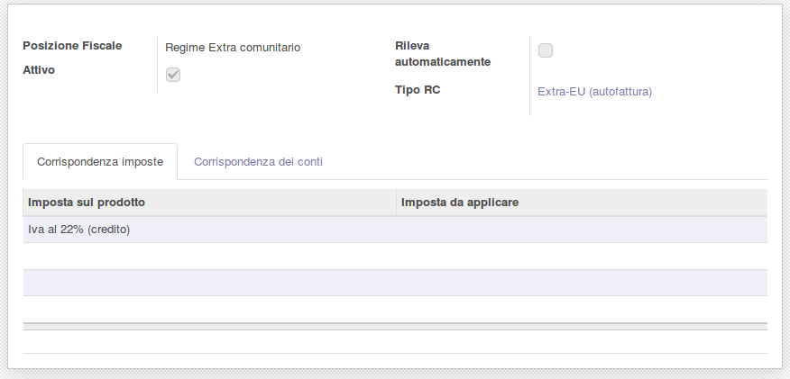
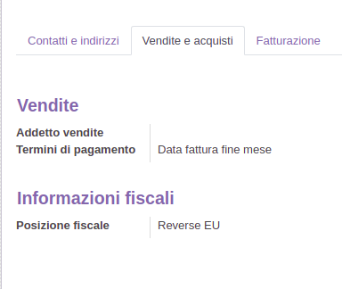

**Italiano**

Creare l'imposta **22% intra UE** - Vendite:

Creare l'imposta **22% intra UE** - Acquisti:

Creare l'imposta **22% extra UE** - Vendite:

Creare l'imposta **22% extra UE** - Acquisti:

Creare il conto 'Transitorio autofatturazione':

Creare il registro 'Riconciliazione RC' di tipo Varie.

Modificare il tipo inversione contabile **Intra-UE (autofattura)**:

Il registro autofattura deve essere di tipo 'Vendita'.

Modificare il tipo inversione contabile **Extra-UE (autofattura)**:

Il 'Registro autofattura passiva' deve essere di tipo 'Acquisto'.

Nella posizione fiscale, impostare il tipo inversione contabile:

La posizione fiscale deve essere salvata sui contatti dei fornitori nel
campo 'Posizione fiscale'

**English**

Create the tax **22% intra EU** - Sale:

Create the tax **22% intra EU** - Purchase:

Create the tax **22% extra EU** - Sale:

Create the tax **22% extra EU** - Purchase:

Create the account 'Self Invoice Transitory' as follows:

Create the 'RC Reconciliation' Journal of type Miscellaneous.

Edit the reverse charge type **Intra-EU (self-invoice)**:

The Self Invoice journal has to be of type 'Sale'.

Edit the reverse charge type **Extra-EU (self-invoice)** :

The 'Supplier Self Invoice Journal' has to be of type 'Purchase'.

In the fiscal position, set the reverse charge type:

Fiscal position has to be saved on suppliers' contact inside 'Fiscal
position' field

