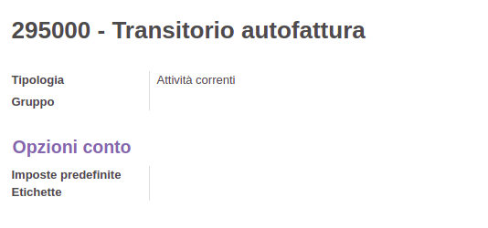

**Italiano**

Creare l'imposta **22% intra UE** - Vendite:

.. figure:: ../static/description/tax_22_v_i_ue.png
   :alt: 22% intra UE - Vendite
   :width: 600 px

Creare l'imposta **22% intra UE** - Acquisti:

.. figure:: ../static/description/tax_22_a_i_ue.png
  :alt: 22% intra UE - Acquisti
  :width: 600 px

Creare l'imposta **22% extra UE** - Vendite:

Creare l'imposta **22% extra UE** - Acquisti:

.. figure:: ../static/description/tax_22_a_e_ue.png
  :alt: 22% extra UE - Acquisti
  :width: 600 px

Creare il conto 'Transitorio autofatturazione':

Il 'Registro pagamento autofattura' deve essere configurato con il conto 'Transitorio autofatturazione' appena creato:

Modificare il tipo inversione contabile **Intra-UE (autofattura)**:

.. figure:: ../static/description/rc_selfinvoice.png
  :alt: inversione contabile con Autofattura
  :width: 600 px

Il registro autofattura deve essere di tipo 'Vendita'.

Modificare il tipo inversione contabile **Extra-UE (autofattura)**:

.. figure:: ../static/description/rc_selfinvoice_extra.png
  :alt: inversione contabile con Autofattura
  :width: 600 px

Il 'Registro autofattura passiva' deve essere di tipo 'Acquisto'.

Nella posizione fiscale, impostare il tipo inversione contabile:

.. figure:: ../static/description/fiscal_pos_intra.png
  :alt: Impostazione posizioni fiscali Intra CEE
  :width: 600 px

.. figure:: ../static/description/fiscal_pos_extra.png
  :alt: Impostazione posizioni fiscali Extra CEE
  :width: 600 px

La posizione fiscale deve essere salvata sui contatti dei fornitori nel campo 'Posizione fiscale'

.. figure:: ../static/description/partner_fiscal_pos.png
  :alt: Impostazione posizioni fiscali Extra CEE
  :width: 600 px

**English**

Create the tax **22% intra EU** - Sale:

.. figure:: ../static/description/tax_22_v_i_ue.png
   :alt: 22% intra UE - Sale
   :width: 600 px

Create the tax **22% intra EU** - Purchase:

.. figure:: ../static/description/tax_22_a_i_ue.png
  :alt: 22% intra UE - Purchase
  :width: 600 px

Create the tax **22% extra EU** - Sale:

Create the tax **22% extra EU** - Purchase:

.. figure:: ../static/description/tax_22_a_e_ue.png
  :alt: 22% extra UE - Purchase
  :width: 600 px

Create the account 'Self Invoice Transitory' as follows:

The 'Self Invoice Payment' Journal has to be configured with the just created 'Self Invoice Transitory' account:

Edit the reverse charge type **Intra-EU (self-invoice)**:

.. figure:: ../static/description/rc_selfinvoice.png
  :alt: reverse charge with Self Invoice
  :width: 600 px

The Self Invoice journal has to be of type 'Sale'.

Edit the reverse charge type **Extra-EU (self-invoice)** :

.. figure:: ../static/description/rc_selfinvoice_extra.png
  :alt: reverse charge with Self Invoice
  :width: 600 px

The 'Supplier Self Invoice Journal' has to be of type 'Purchase'.

In the fiscal position, set the reverse charge type:

.. figure:: ../static/description/fiscal_pos_intra.png
  :alt: Impostazione posizioni fiscali Intra CEE
  :width: 600 px

.. figure:: ../static/description/fiscal_pos_extra.png
  :alt: Impostazione posizioni fiscali Extra CEE
  :width: 600 px

Fiscal position has to be saved on suppliers' contact inside 'Fiscal position' field

.. figure:: ../static/description/partner_fiscal_pos.png
  :alt: Impostazione posizioni fiscali Extra CEE
  :width: 600 px
