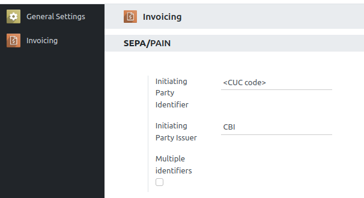
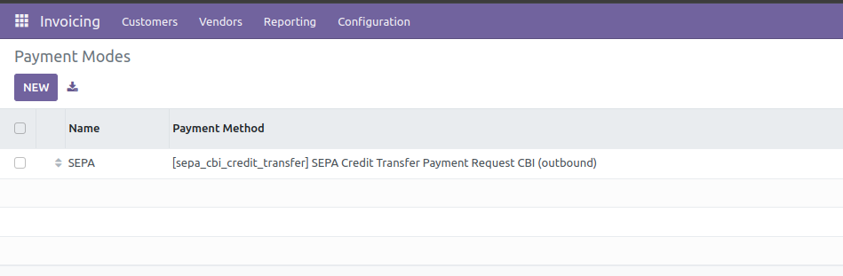
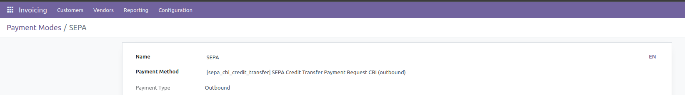

In Invoicing / Configuration / Settings / SEPA/PAIN, set:
- the CUC code in field `Initiating Party Identifier`
- the `Initiating Party Identifier` (must be "CBI").

------------------------------------------------------------------------

In Invoicing / Configuration / Management / Payment Modes, create a new payment mode.

------------------------------------------------------------------------

In the new payment mode is important to set the Italian format SEPA CBI

