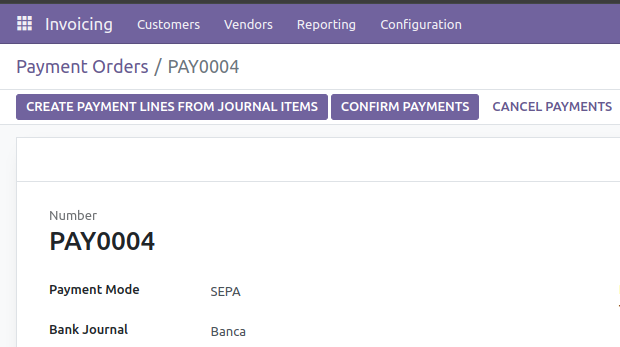

This module uses the grouped payments implemented by the OCA in
`account_payment_order`, grouped payments are also implemented in Odoo EE.

When you create a new payment order, you must select the payment mode
created during configuration

In order to get the xml file:
1. click on "Confirm payments"
2. click on "Generate payment file"

------------------------------------------------------------------------

Then you can download the generated file

