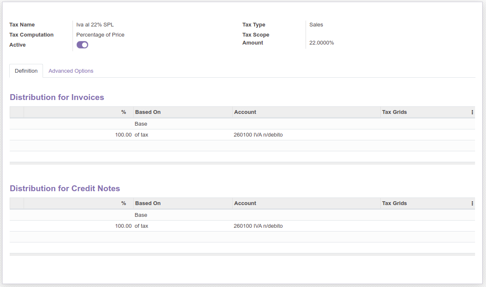
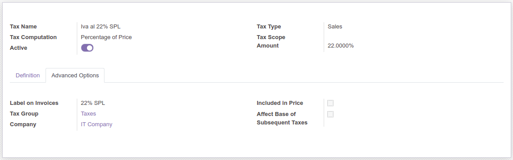

.. image:: https://img.shields.io/badge/licence-AGPL--3-blue.svg
   :target: http://www.gnu.org/licenses/agpl-3.0-standalone.html
   :alt: License: AGPL-3

====================================
Italian Localization - split payment
====================================

Law: http://goo.gl/1riAwt (Articolo 17 ter)

Module to generate Split Payment accounting entries

Configuration
=============

To configure this module, you need to:

* go to Accounting, Configuration, Settings and configure 'Split Payment Write-off account' (like 'IVA n/debito sospesa SP'). Write-off account should be different from standard debit VAT, in order to separately add it in VAT statement.
* configure the fiscal position (Accounting, Configuration, Accounting, Fiscal Positions) used for split payment, setting 'Split Payment' flag. In fiscal position, map standard VAT with SP VAT, like the following:

.. figure:: static/fiscal_position.png
   :alt: Fiscal position
   :width: 600 px

-------------------------------------------------------------------------------

IVA al 22% SPL is configured like the following:

Usage
=====

To use this module, you need to select the correct fiscal position in invoices

.. image:: https://odoo-community.org/website/image/ir.attachment/5784_f2813bd/datas
   :alt: Try me on Runbot
   :target: https://runbot.odoo-community.org/runbot/122/8.0

Bug Tracker
===========

Bugs are tracked on `GitHub Issues
<https://github.com/OCA/l10n-italy/issues>`_. In case of trouble, please
check there if your issue has already been reported. If you spotted it first,
help us smashing it by providing a detailed and welcomed feedback.

Credits
=======

Contributors
------------

* Davide Corio <davide.corio@abstract.it>
* Lorenzo Battistini <lorenzo.battistini@agilebg.com>
* Alessio Gerace <alessio.gerace@agilebg.com>

Maintainer
----------

.. image:: https://odoo-community.org/logo.png
   :alt: Odoo Community Association
   :target: https://odoo-community.org

This module is maintained by the OCA.

OCA, or the Odoo Community Association, is a nonprofit organization whose
mission is to support the collaborative development of Odoo features and
promote its widespread use.

To contribute to this module, please visit https://odoo-community.org.
