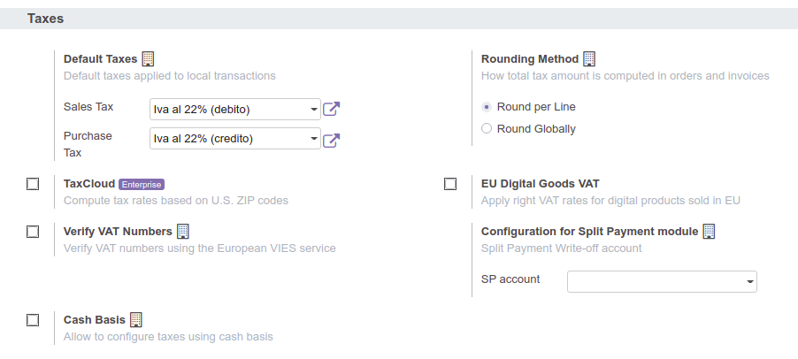

**Italiano**

Per configurare questo modulo è necessario:

* andare in Contabilità → Configurazione → Impostazioni e configura "Conto storno scissione pagamenti" (es. 'IVA n/debito sospesa SP'). Il conto storno dovrebbe essere diverso dall'IVA a debito standard, in modo da aggiungerlo separatamente nella dichiarazione IVA.

**English**

To configure this module, you need to:

* go to Accounting → Configuration → Settings and configure 'Split Payment Write-off account' (like 'IVA n/debito sospesa SP'). Write-off account should be different from standard debit VAT, in order to separately add it in VAT statement.

-------------------------------------------------------------------------------

**Italiano**

* aggiungere una nuova imposta (Contabilità → Configurazione → Contabilità → Imposte). IVA al 22% SPL deve essere configurata nel modo seguente:

**English**

* add a new tax (Accounting → Configuration → Accounting → Taxes). IVA al 22% SPL should be configured like the following:

.. figure:: ../static/SP.png
   :alt: 22SPL
   :width: 600 px

.. figure:: ../static/SP2.png
   :alt: 22SPL
   :width: 600 px

-------------------------------------------------------------------------------

**Italiano**

* configurare la posizione fiscale (Contabilità → Configurazione → Contabilità → Posizioni fiscali) usata per la scissione dei pagamenti, selezionando la casella "Scissione pagamenti". Nella posizione fiscale mappare l'IVA standard con l'IVA SP, come indicato di seguito:

**English**

* configure the fiscal position (Accounting → Configuration → Accounting → Fiscal Positions) used for split payment, setting 'Split Payment' flag. In fiscal position, map standard VAT with SP VAT, like the following:

