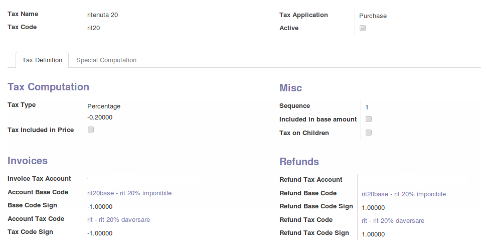

.. image:: https://img.shields.io/badge/licence-AGPL--3-blue.svg
    :alt: License: AGPL-3

Italian withholding taxes
=========================

Configuration
=============

In accounting configuration you have to set

 - Withholding tax payment term
 - Payable account for withholding taxes to pay
 - Withholding tax journal

You have to set the flag 'Withholding Tax' in tax codes related to
withholding taxes

Configure withholding tax like the following

Usage
=====

To use this module, you need to add the withholding tax to subjected invoice lines

Credits
=======

Contributors
------------

* Lorenzo Battistini <lorenzo.battistini@agilebg.com>
* Paolo Chiara <p.chiara@isa.it>

Maintainer
----------

.. image:: https://odoo-community.org/logo.png
   :alt: Odoo Community Association
   :target: https://odoo-community.org

This module is maintained by the OCA.

OCA, or the Odoo Community Association, is a nonprofit organization whose
mission is to support the collaborative development of Odoo features and
promote its widespread use.

To contribute to this module, please visit http://odoo-community.org.
