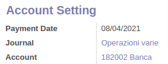

**Italiano**

Per generare il pagamento di una ritenuta d'acconto:

1. Aprire Fatturazione > Contabilità > Ritenuta d'acconto > Movimenti RdA.
2. Selezionare i movimenti di cui si vuole fare il pagamento
3. Cliccare su Azione > Crea movimento di pagamento
4. Nel popup, cliccare su Genera

Verrà quindi visualizzato un 'Movimento di pagamento RdA' che rappresenta il pagamento delle ritenute selezionate al punto 2.

Confermare il Movimento di pagamento RdA e compilare i campi in Impostazioni conto:

* Data pagamento: la data in cui è stato effettuato il pagamento.
* Registro: il registro in cui verrà salvata la registrazione contabile.
* Conto: il conto della banca tramite il quale si farà il pagamento.

Ad esempio:

Creare la registrazione contabile cliccando su 'Crea movimento contabile': la registrazione creata sarà accessibile tramite il campo "Movimento contabile".

**English**

In order to generate a withholding tax payment:

1. Open Accounting > Accounting > Withholding tax > WT Moves.
2. Select the transactions you want to pay for
3. Click Action > Create Payment Move
4. In the pop-up, click Generate

A 'WT Payment Move' will then be displayed representing the payment of the withholding taxes selected in step 2.

Confirm the RdA Payment Movement and fill in the fields in Account Setting:

* Payment Date: The date the payment was made.
* Register: the journal where the journal entry will be saved.
* Account: the bank account through which the payment will be made.

Eg:

Create the journal entry by clicking on 'Create Account Move': the created journal entry will be accessible through the "Account Move" field.
